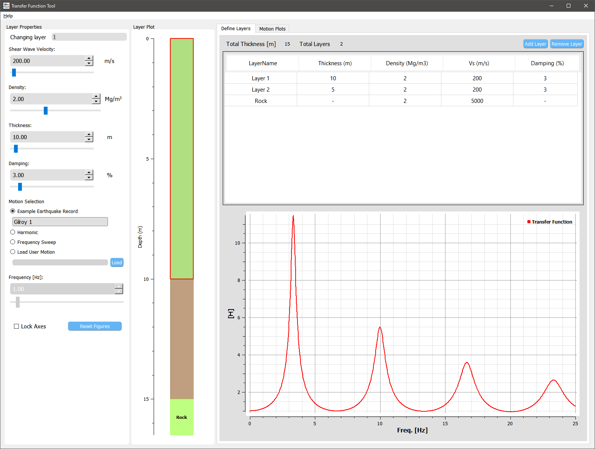
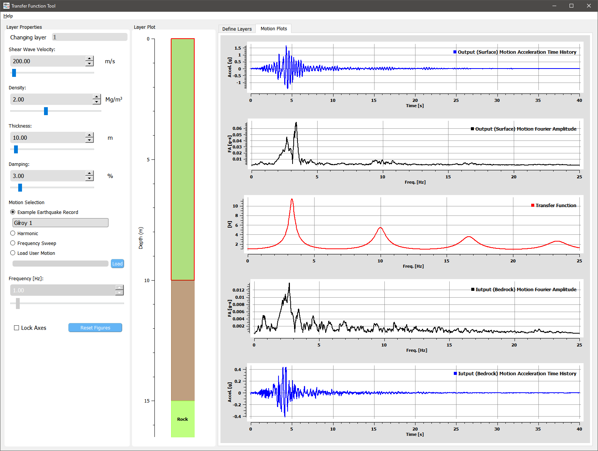

.. _quickstart:

Quick start
================================

Download |appName| 
------------------------------------------------

The app can be downloaded from `here <https://www.designsafe-ci.org/data/browser/public/designsafe.storage.community/SimCenter/Software/>`_. 

Installation is generally not required. However, if Microsoft Visual C++ Runtime Library error is encountered, this issuer can be solved by 
installing the latest version of Microsoft Visual C++. A installer, *vc_redist.x64.exe*, is included in the zip file.

User Interface 
-------------------------------------------------

As shown in the figures below, the tool's main window consists of three major groups: left control group, Layer Plot, and a tab view that can be switched for defining 
layers or showing motion plots. In the "Layer Properties" group, the lineedits and sliders can be used to change properties (thickness, density, etc.) of current active layer as 
indicated in the "Changing layer" as well as highlighted in the layer plot and table view. Thickness and damping ratio of bedrock layer is not changeable since the soil layers are 
assumed to be on top of an infinite half space. 

    User interface with "Defining Layers" tab shown
	

    User interface with "Motion Plots" tab shown

Add/remove soil layers 
-------------------------------------------------

Under Layer tab, click the 'Add Layer'/ 'Remove Layer' button on the top of the table to add/remove a soil layer. 

Modify properties of a layer
-------------------------------------------------

Density, thickness, shear wave velocity, and damping ratio can be modified for each layer. Click on the layer plot or any row in the layer table to select a soil layer. 
Subsequently, lineedits and sliders are associated to the selected layer.

Select a different input motion 
-------------------------------------------------
Several input motions are pre-included in this tool including earthquake recordings, harmonic vibration, as well as frequency sweep time series. The frequency lineedit and 
slider can be used to vary the frequency of the harmonic vibration, thus will only be enabled when this motion is selected. 

Lock axes 
-------------------------------------------------
By default, the axis limits of each figure are replotted after any changes in properties or motion. However, these limits can be locked by checking the "Lock Axes" checkbox. Then the 
effect of each property on transfer function can be visualized and compared. To reset axes, simply click the "Reset Figures" button.  

