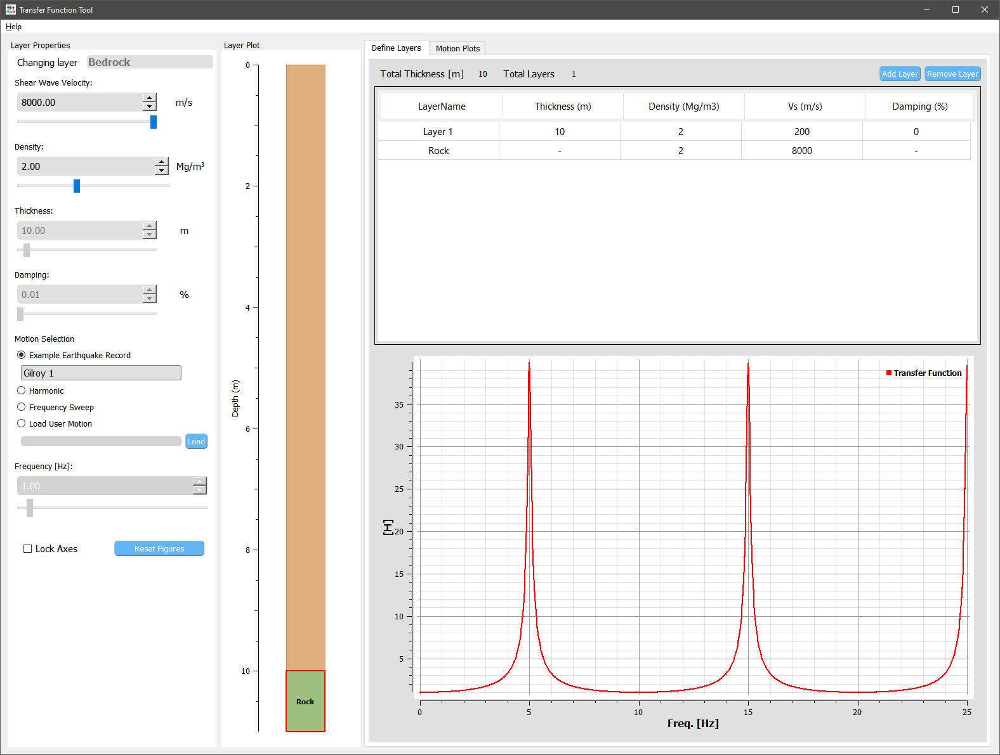
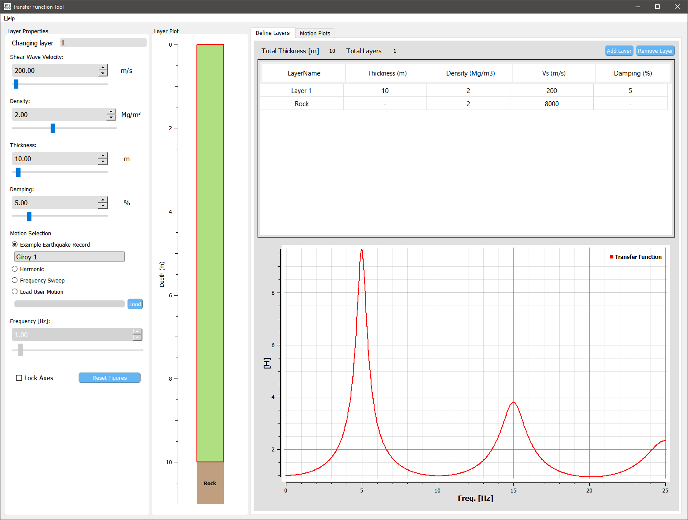
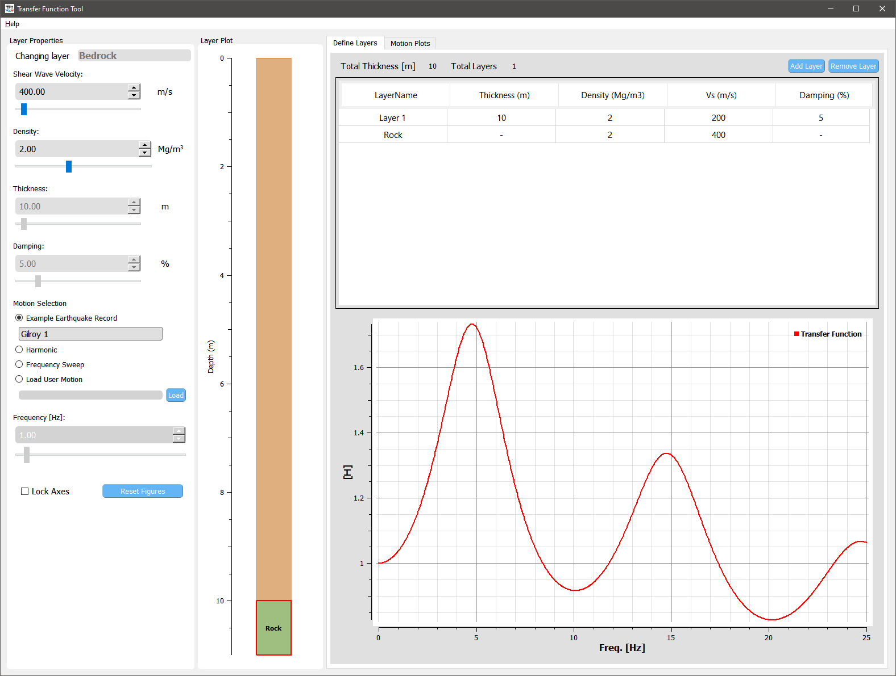
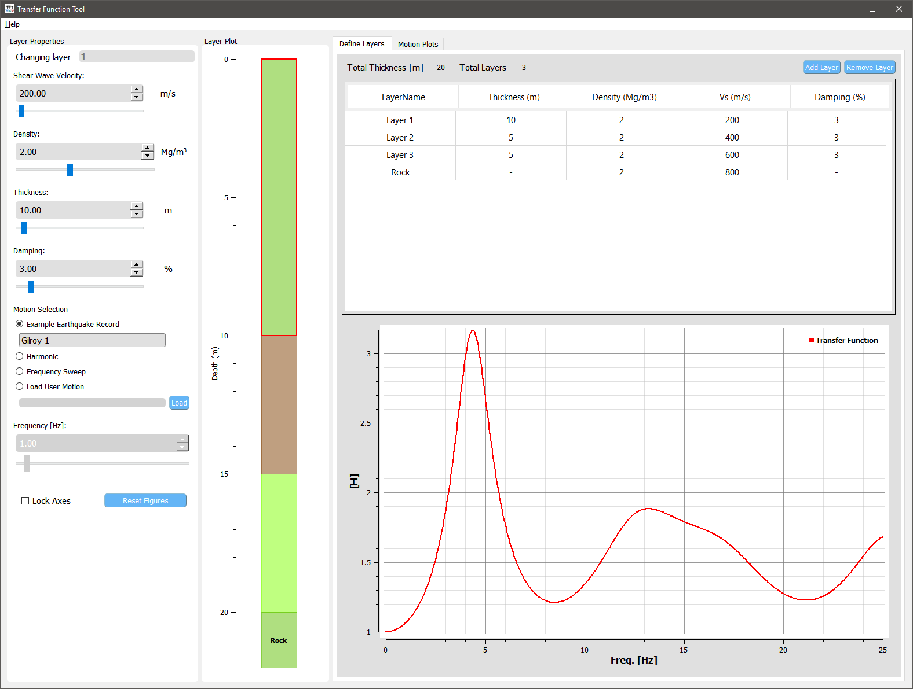

Theory and Examples
==========================
This page describes basic concepts of one-dimensional ground response analysis and the usage of transfer functions. For more details, the user is encounged to read :cite:`Kramer1996`.

One-dimensional ground response analysis
--------------------------------------------
Evaluation of ground response is one of the most common tasks in geotechnical earthquake engineering. Ground response analyses are used to predict ground surface 
motions, to develop design response spectra, to evaluate potential for liquefaction, and to determine earthquake induced loads to super structures. As seismic 
body waves travel through different geologic units, they are reflected and refracted when reaching boundaries. One-dimensional ground response analyses are based
on the assumption that all boundaries are horizontal and that the response of a soil deposit is predominantly caused by SH-waves propagating vertically from the 
underlying bedrock. 

Transfer function
-------------------

An important method for ground response analysis is based on the use of transfer functions, which determine how each frequency in the bedrock (input) motion is 
amplified, or deamplified, by the soil deposit. A transfer function may be viewed as a filter that acts upon some input signal to produce an output signal. 
For one dimensional site response analysis, the transfer function can be used to calcualte various response parameters, such as acceleration, velocity, 
displacement, shear stress, and shear strain, under an input motion parameter such as a bedrock acceleration. Because this method relies on the principle of 
superposition, this analysis is limited to the analysis of linear systems.

The basic steps are as following:

#. Obtain the Fourier series for the applied motion using the Fast Fourier Transform (FFT).

#. Multiply the Fourier series by the appropriate value of the transfer function at each frequency to obtain the output Fourier series.

#. Express the output Fourier series in the time domain using the inverse FFT.

The greatest amplification will occur approximately at the lowest natural frequency, also know as the **fundamental frequency**.
For a uniform soil profile the fundamental frequency is

.. math::
	\omega_0 = \frac{\pi v_s}{2H}

where :math:`v_s` and :math:`H` are the shear wave velocity and thickness of the soil profile.

The period of vibration corresponding to the fundamental frequency is called the **characteristic site period**:

.. math::
	T_s = \frac{2\pi}{\omega_0} = \frac{4H}{v_s}

Evaluation of Transfer function
-------------------------------------------------------------
Within the profile, both upward and downward travelling waves exist due to reflection at each layer boundary (refraction 
is ignored in 1D assumption). When the bedrock is rigid, any downward travelling waves in the soil are completely reflected back toward the 
ground surface. Thus all elastic wave energy is trapped in the system. An elastic bedrock, on the other hand, only reflects part of the
downward travelling waves that reach the soil-rock interface; part of the elastic wave energy is transmitted through the interface and lost from
the system. This is a form of radiation damping and it causes the free surface motion amplitudes to be smaller than those for the case of 
rigid bedrock. The fraction of reflected waves depends on the *complex impedance ratio*, :math:`\alpha_z`, that is defined as,

.. math::
	\frac{G^*_mk^*_m}{G^*_{m+1}k^*_{m+1}} = \frac{\rho_m(v_s^*)_m}{\rho_{m+1}(v_s^*)_{m+1}} \,,

where :math:`G^*,\,k^*,\,v_s^*` are the complex shear modulus, complex wave number, and complex shear wave velocity, respectively.

    Schematic for a layered soil deposit on rock

:cite:`Kramer1996` presents details about the evaluation of transfer functions for four different cases by varing the assumptions for soil and 
bedrock, respectively. These cases are replicated in the figures below using this tool: 

Unifom, undamped soil on rigid rock
*************************************

    Transfer function for an uniform, undamped soil on rigid rock

Uniform, damped soil on rigid rock
*************************************

    Transfer function for an uniform, damped soil on rigid rock

Unifom, damped soil on elastic rock
*************************************

    Transfer function for an uniform, damped soil on elastic rock with impedance ratio = 0.5

Layered, damped soil on elastic rock
*************************************

    Transfer function for layered, damped soil on elastic rock

Rigid bedrock vs. elastic bedrock
----------------------------------------------------
If the **within** motion is known, a rigid bedrock condition should be used for estimating the surface motion. In this tool, a rigid based condition can be approximately represented by increasing the stiffness (shear wave velocity and/or density) of the bedrock. When including the elastic bedrock a **bedrock** motion should be used instead. A bedrock motion can be obtained from the decombolution of an **outcrop** (surface) motion.

.. bibliography:: references.bib

